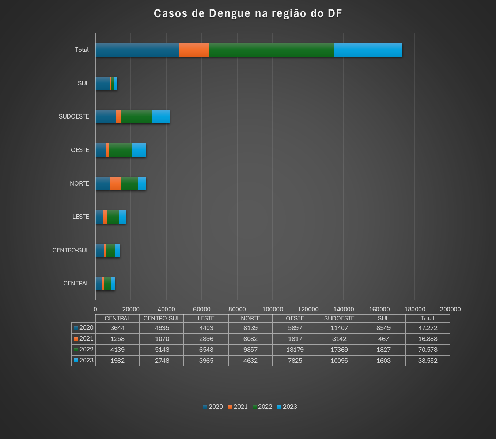

# Análise Preditiva com Modelos de Aprendizagem de Máquina de Regressão nos Dados do Monitoramento Epidemiológico da Dengue no Distrito Federal (2019-2023)

 
## ⚡ Tecnologias Utilizadas

  </img>

 

# 1
Iniciamos um novo projeto com o objetivo de analisar os casos de dengue no Distrito Federal ao longo dos anos de 2019 a 2023, organizados por regiões administrativas. Para garantir a confiabilidade dos dados, buscamos fontes oficiais, encontrando os boletins epidemiológicos no site do governo.

# 2
O primeiro desafio foi coletar e organizar os dados dispersos nos boletins epidemiológicos. Isso exigiu a análise de múltiplos documentos e a consolidação das informações em uma planilha única.

# 3
Com os dados em mãos, o próximo passo foi determinar a melhor forma de tratá-los e analisá-los. Optamos por utilizar a linguagem de programação Python devido à sua versatilidade e às inúmeras bibliotecas disponíveis para análise de dados.

## Resultado da primeira análise

# 4
Uma parte crucial do projeto foi a visualização dos resultados em um mapa coroplético, mostrando a distribuição dos casos de dengue por região administrativa. Para isso, foi necessário obter dados geoespaciais. Encontramos um arquivo no formato Shapefile (.shp) no site do IBGE, que foi convertido para o formato JSON para facilitar a integração com nossos dados.

Com todos os passos concluídos, pudemos analisar os dados de forma mais abrangente e identificar padrões e tendências nos casos de dengue ao longo dos anos no Distrito Federal.

| Região      | Localidades                                         |
|-------------|-----------------------------------------------------|
| CENTRAL     | Cruzeiro, Lago Norte, Lago Sul, Plano Piloto,      |
|             | Sudoeste Octogonal, Varjão                          |
| CENTRO-SUL  | Candangolândia, Estrutural, Guará, Núcleo Bandeirante, |
|             | Park Way, Riacho Fundo I, Riacho Fundo II, SIA     |
| LESTE       | Jardim Botânico, Itapoã, Paranoá, São Sebastião   |
| NORTE       | Fercal, Planaltina, Sobradinho, Sobradinho II     |
| OESTE       | Brazlândia, Ceilândia                               |
| SUDOESTE    | Águas Claras, Recanto Das Emas, Samambaia,         |
|             | Taguatinga, Vicente Pires                          |
| SUL         | Gama, Santa Maria                                   |

# 5
Quinto passo, para o desenvolvimento do meu Trabalho de Conclusão de Curso (TCC), escolhi utilizar uma Rede Neural Artificial (RNA) como modelo de regressão para prever os casos de dengue com base em diversas variáveis, como características socioeconômicas e demográficas, até o momento. O motivo de esolher o RNA foi porque As Redes Neurais Artificiais são modelos poderosos de aprendizado de máquina capazes de capturar relações complexas entre variáveis de entrada e saída. Ao contrário de modelos de regressão tradicionais, as RNAs podem aprender padrões intrincados nos dados, tornando-as ideais para lidar com problemas complexos e não lineares, como a previsão de casos de dengue, que podem ser influenciados por uma variedade de fatores inter-relacionados.

# Links utilizados para pesquisa e extração de dados
Link dos dados : https://www.saude.df.gov.br/informes-dengue-chikungunya-zika-febre-amarela

Link do arquivo (.shp): https://portaldemapas.ibge.gov.br/portal.php#mapa201483

Link do site que utilizei para converter o .shp para json: https://mapshaper.org/

# Pessoas envolvidas 

Este projeto foi possível graças ao trabalho e dedicação das seguintes pessoas:

- [Lucas Santos Dalmaso](https://github.com/07Dalmaso) - Desenvolvedor/Análisa do dados
- [Sabrina Mendes Braga](https://github.com/contribuidor2) - Desenvolvedor/Análisa do dados
- [Nome do Contribuidor 3](https://github.com/contribuidor3) - Função/Contribuição

Por favor, sinta-se à vontade para nos contatar ou contribuir com este projeto.
